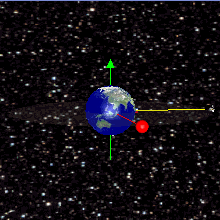

<p align="center"></p>

# Microsserviço de Consultas de informações sobre satelites geoestacionários 

api de consulta satélites geoestacionários

## 🚀 Começando

Essas instruções permitirão que você obtenha uma cópia do projeto em operação na sua máquina local para fins de desenvolvimento e teste.

Consulte **Implantação** para saber como implantar o projeto.

### 📋 Pré-requisitos

### 🔧 Instalação

De que coisas você precisa para instalar o software e como instalá-lo?

baixe o projeto e descompacte a pasta e cesse a pasta descompactada

Baixe as dependências do projeto 
```
mvn clean install
```
Em seguida execute a aplicação

```
mvn spring-boot:run
```

## 🛠️ Construído com

Mencione as ferramentas que você usou para criar seu projeto

* [SpringBoot](https://spring.io/projects/spring-boot) - O framework web usado
* [Maven](https://maven.apache.org/) - Gerente de Dependência
* [Travis-CI](https://app.travis-ci.com/github/Mario23junior/Minerals-API) - Usando a integração contínua
* [Swagger](https://swagger.io/tools/swagger-ui/) - descrição de interface para descrever APIs RESTfull
* [Flyway](https://flywaydb.org/) -  Versionamento e administração do Banco de dados, com ele podemos conduzir a evolução do banco de dados


## Para obter mais detalhes da documentação acesse o swagger
```
http://localhost:8080/swagger-ui.html
```

## Uso

## Contribuindo
Solicitações pull são bem-vindas. Para mudanças importantes, abra um problema primeiro para discutir o que você gostaria de mudar.

Certifique-se de atualizar os testes conforme apropriado.

## License
[MIT](https://choosealicense.com/licenses/mit/)
